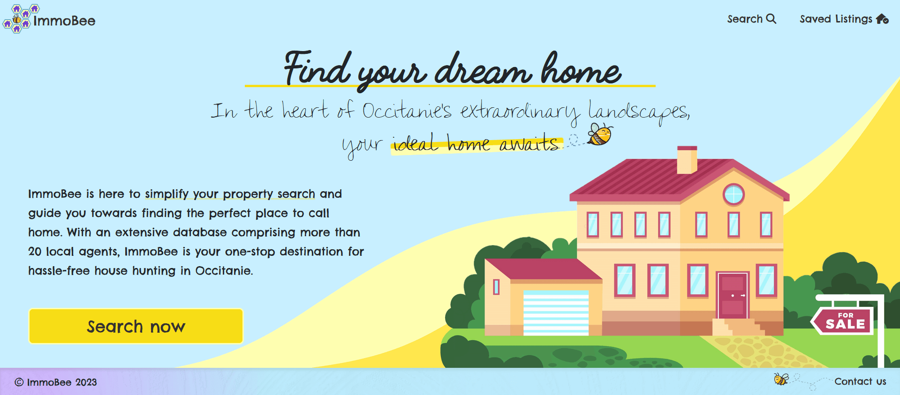

# ImmoBee

<!-- TABLE OF CONTENTS -->
  
<h2 style="display: inline-block">Table of Contents</h2>

  

  <ol>
    <li>
      <a href="#about-the-project">About the project</a>
    </li>
    <li>
      <a href="#demo-and-screenshots">Demo and screenshots</a>
    </li>
    <li>
      <a href="#installation-and-setup-instructions">Installation and setup instructions</a>
    </li>
    <li>
      <a href="#technologies-used">Technologies used</a>
    </li>
    <li>
      <a href="#next-steps">Next steps</a>
    </li>
    <!-- <li>
      <a href="#current-issues">Current issues</a>
    </li> -->
    <li>
      <a href="#contributing">Contributing</a>
    </li>
    <li><a href="#license">License</a></li>
  </ol>

 

## About the project

<a href="https://immobee.app/" target="_blank">immobee.app</a> is an open-source project designed to streamline the process of searching for properties for sale in a particular region by aggregating real estate agent data from various sources into a single platform. 

This repository contains the frontend code for ImmoBee, that queries various APIs that scrape estate agent data so that listings from all agents can be viewed together in one place.

All of the backend code for this project including APIs and scrapers can be found [here](https://github.com/suspiciousleaf/immo_app).
  

## Demo and screenshots
A demo of ImmoBee's functionality:
  

  

   

ImmoBee is fully responsive for all screen sizes. Here's the homepage on different screen types (desktop, tablet, and mobile):
 

  
    
  
  &nbsp;&nbsp;&nbsp;&nbsp;&nbsp;
  

 
<h1 style="border-bottom: none;">
  Live version <a href="https://immobee.app/" target="_blank">here</a>.
</h1>

## Installation and setup instructions
This project was bootstrapped with [Vite](https://vitejs.dev/).

### Installation

First clone the repository to your local machine and navigate to the project directory.

Then install the project dependencies using:

#### `npm install`

You can run the app in development mode using:

#### `vite`

Then open [http://127.0.0.1:5173/](http://127.0.0.1:5173/) to view it in your browser. The page will reload when you make changes.

To run the app in production, you can compile and optimize the app for deployment using:
#### `npm run build`

This creates a production-ready build in the `dist` folder.
  

## Technologies used
### ImmoBee relies on the following dependencies:
* [Vite](https://vitejs.dev/)
* [React Router v6](https://reactrouter.com/en/main)
* [React Paginate](https://www.npmjs.com/package/react-paginate)
* [React Widgets](https://jquense.github.io/react-widgets/docs/)
* [React Hook Form](https://react-hook-form.com/)
* [React Slick](https://react-slick.neostack.com/)
* [Axios](https://axios-http.com/docs/intro)
* [Sass](https://sass-lang.com/)
  

## Next steps
* Create a 'featured listings' widget that rotates featured listings every few weeks
* Possibly adding authentication so that users can retrieve their saved listings on any device
* Add unit tests
  

<!-- ## Current issues
[coming soon]
   -->

## Contributing
If you find a bug, or wish to request new features, please open an issue [here](https://github.com/AmyMaule/real-estate-immobee/issues/new), including as much information as you can.
  

## License
MIT © [Amy Maule](https://github.com/AmyMaule)
